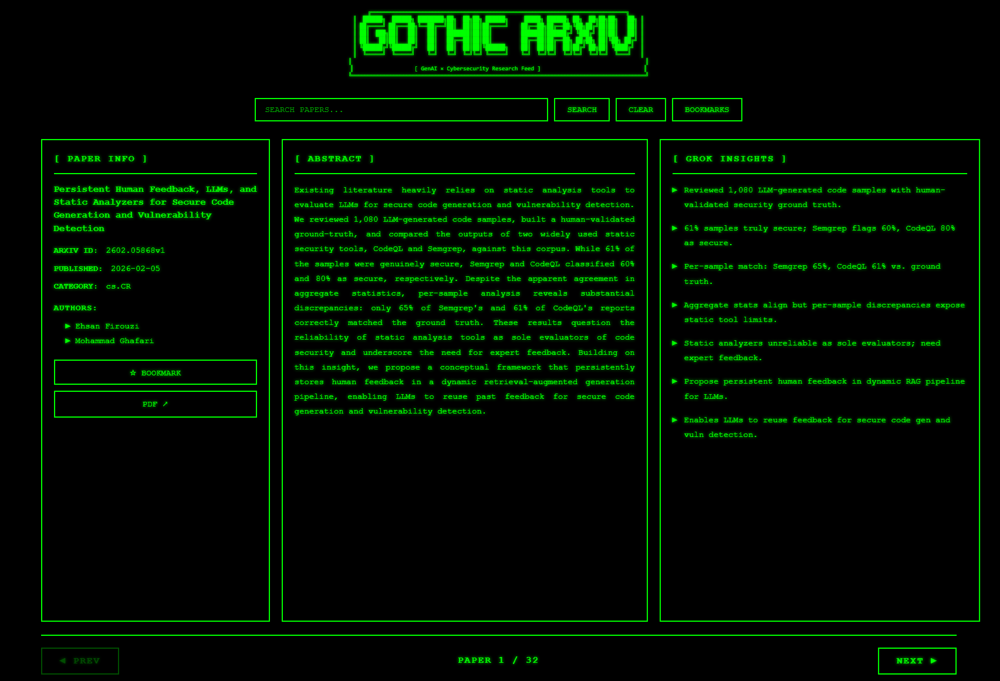

# arXiv Feed Viewer

A personal project to create a focused feed for arXiv publications of my interest -- specifically papers at the intersection of **Generative AI** and **Cybersecurity** (cs.CR). Built with a techno-gothic terminal aesthetic, "Gothic arXiv", powered by Grok AI for paper analysis.

## Author

**Juhani Merilehto** ([@juhanimerilehto](https://github.com/juhanimerilehto))

## Features

- **Automated Paper Fetching**: Fetches from arXiv for GenAI + Cybersecurity papers (cs.CR category)
- **AI-Powered Analysis**: Grok AI extracts 5-7 key technical insights from each paper
- **Full-Text Search**: SQLite FTS5 enables fast keyword search across titles and abstracts
- **Techno-Gothic Aesthetic**: Pure black background, phosphor green text, ASCII art borders
- **Three-Column Layout**: Metadata | Abstract | AI Insights
- **Bookmark System**: Save papers for later review
- **Keyboard Navigation**: Arrow keys for quick browsing




## Installation

### Prerequisites

- Python 3.9+
- Grok API key from [x.ai](https://x.ai/)

### Setup

1. **Clone the repository**
```bash
git clone https://github.com/juhanimerilehto/arxiv-feed-viewer.git
cd arxiv-feed-viewer
```

2. **Create virtual environment**
```bash
python -m venv venv
venv\Scripts\activate  # On Windows
# source venv/bin/activate  # On Linux/Mac
```

3. **Install dependencies**
```bash
pip install -r requirements.txt
```

4. **Configure environment**

Copy `.env.example` to `.env` and add your Grok API key:
```bash
cp .env.example .env
```
Then edit `.env`:
```env
GROK_API_KEY=your_api_key_here
```

5. **Initialize database**
```bash
python scripts/init_db.py
```

6. **Fetch initial papers**
```bash
python backend/tasks/daily_fetch.py
```

## Usage

### Start the application

```bash
python run_server.py
```

Or with uvicorn directly:
```bash
uvicorn backend.main:app --reload --host 127.0.0.1 --port 8000
```

Then open your browser to: **http://localhost:8000**

### API Documentation

FastAPI auto-generates interactive API docs at:
- **Swagger UI**: http://localhost:8000/docs
- **ReDoc**: http://localhost:8000/redoc

## Daily Automation (Windows)

### Option 1: Manual Task Scheduler Setup

1. Open **Task Scheduler** (taskschd.msc)
2. Create New Task:
   - **Name**: ArxivFeedDailyFetch
   - **Trigger**: Daily at 3:00 AM
   - **Action**: Start `scripts\run_daily_fetch.bat`
   - **Settings**: Run whether user is logged on or not

### Option 2: Automated Setup (PowerShell)

Run as Administrator:
```powershell
cd scripts
.\setup_task_scheduler.ps1
```

## Navigation

### Mouse Controls
- **PREV/NEXT buttons**: Navigate between papers
- **SEARCH button**: Full-text search
- **BOOKMARKS button**: Toggle bookmarks view
- **BOOKMARK button**: Save/unsave current paper

### Keyboard Controls
- **Left / Right arrow**: Navigate previous/next paper
- **Enter** (in search box): Execute search

## Project Structure

```
arxiv-feed-viewer/
├── backend/              # FastAPI application
│   ├── main.py          # App entry point
│   ├── config.py        # Configuration
│   ├── database.py      # SQLAlchemy setup
│   ├── models.py        # Database models
│   ├── schemas.py       # Pydantic schemas
│   ├── routers/         # API endpoints
│   ├── services/        # Business logic
│   └── tasks/           # Background tasks
├── frontend/            # HTML/CSS/JS
│   ├── index.html
│   └── static/
├── data/                # SQLite DB and PDFs (gitignored)
├── logs/                # Application logs (gitignored)
├── scripts/             # Utilities and automation
├── .env.example         # Configuration template
├── requirements.txt     # Python dependencies
└── run_server.py        # Server launcher
```

## Configuration

Copy `.env.example` to `.env` and customize:

```env
# API Keys
GROK_API_KEY=your_key_here

# Paths
DATABASE_PATH=data/arxiv.db
PDF_STORAGE_PATH=data/pdfs

# arXiv Search
ARXIV_SEARCH_QUERY=cat:cs.CR AND (abs:LLM OR abs:"Large Language Model" OR abs:"Generative AI" OR abs:GenAI)
ARXIV_MAX_RESULTS=10
ARXIV_DAYS_BACK=7

# Server
HOST=127.0.0.1
PORT=8000
DEBUG=true
```

## Troubleshooting

### No papers showing up
1. Check if database was initialized: `python scripts/init_db.py`
2. Run manual fetch: `python backend/tasks/daily_fetch.py`
3. Check logs in `logs/daily_fetch.log`

### Grok API errors
- Verify API key in `.env`
- Check rate limits (script uses conservative 6-second delays)
- Review `logs/app.log` for details
- See `GROK_API_FIX.md` for detailed troubleshooting

### Search not working
- Ensure FTS5 table was created during init
- Check `data/arxiv.db` exists
- Try running `python scripts/init_db.py` again

## Technology Stack

- **Backend**: FastAPI + Uvicorn
- **Database**: SQLite with FTS5
- **Frontend**: Vanilla HTML/CSS/JS (no frameworks)
- **APIs**: arXiv API + Grok xAI API
- **ORM**: SQLAlchemy

## License

MIT License - feel free to modify and use for your own projects.

## Credits

- **arXiv**: Paper source via [arXiv API](https://arxiv.org/help/api)
- **Grok AI**: Paper analysis via [x.ai API](https://x.ai/)
- **FastAPI**: Web framework
- **SQLAlchemy**: ORM for database management
